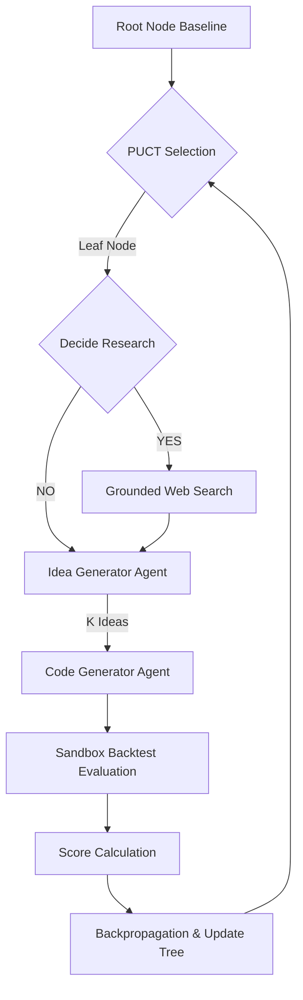

# Pathfinder: LLM-Driven Monte Carlo Tree Search for Strategy Optimization

Pathfinder is a research framework that uses a Monte Carlo Tree Search (MCTS) variant based on the **PUCT (Predictor Upper Confidence bound applied to Trees)** algorithm to systematically optimize quantitative trading strategies. 

It executes code modifications inside parallel, sandboxed backtest environments, evaluates execution metrics, incorporates web-search grounding to discover mathematical concepts, and guides the code evolution tree toward optimal parameters.

---

## 1. System Architecture



Pathfinder is designed to expand multiple leaf nodes concurrently. In parallel execution mode, each node is processed in its own isolated sandbox worker, accelerating the tree search.

---

## 2. Directory Structure

All files reside within the `pathfinder` directory:

*   **`config.py`**: Configuration constants, including API keys, model parameters, exploration constants, and start/end backtest dates.
*   **`client.py`**: Client wrapper for the `google-genai` SDK supporting search grounding and JSON schema output.
*   **`sandbox.py`**: Strategy runner that manages backups, writes candidate code, executes the local Nifty backtester, and scores strategies.
*   **`tree.py`**: Tree structures, PUCT calculation, backpropagation, and state serialization.
*   **`research.py`**: Research agent deciding if web search is needed and conducting searches.
*   **`generator.py`**: Agents that propose strategy changes and generate Python code.
*   **`main.py`**: Main orchestrator running MCTS loops.
*   **`visualise/`**: Contains code to visualize the generated tree in an interactive browser application.

---

## 3. Installation & Setup

Ensure the workspace virtual environment is configured and active. Install the necessary library dependencies:

```bash
# Activate your workspace venv
source venv/bin/activate

# Install requirements
pip install google-genai pydantic pyyaml
```

Set your Gemini API Key in the environment or update it in `pathfinder/config.py`:

```bash
export GEMINI_API_KEY="your-gemini-api-key"
```

---

## 4. How to Use Pathfinder

### Run a Strategy Optimization Loop
Execute a search loop of $N$ iterations (default 10) with $K$ children proposed per expansion step (default 3):

```bash
python -m pathfinder.main --iterations 5 --children 3 --start-date 2026-04-01 --end-date 2026-04-05
```

### Run Concurrently with Parallel Workers
Expand multiple nodes in the tree concurrently to speed up the search:

```bash
python -m pathfinder.main --iterations 5 --children 3 --workers 4
```

### Resume from a Saved Tree State
You can resume a previously interrupted search by specifying the path to the serialized `tree_state.json`:

```bash
python -m pathfinder.main --resume pathfinder/results/tree_state.json --iterations 5
```

### Select Search Algorithm (MCTS vs PUCT)
By default, Pathfinder uses classical PUCT. To run search using classical MCTS (UCT), pass `--mcts` or `--algorithm mcts`:

```bash
python -m pathfinder.main --mcts --iterations 5 --children 3
# or
python -m pathfinder.main --algorithm mcts --iterations 5
```

### Directed Acyclic Graph (DAG) Variant
By default, standard MCTS/PUCT generates new search nodes (child strategies) by expanding a single parent node. Pathfinder also includes a **DAG variant** that enables the LLM generator to combine/merge multiple parent strategies together:
* **DAG Iterations**: If enabled, Pathfinder runs a DAG step periodically at set intervals (e.g., every 5 iterations).
* **Multi-Parent Selection**: The engine selects up to $N$ parent nodes (e.g., top 3) with the highest performance scores in the tree.
* **Crossover Generation**: The LLM generator is supplied with the implementation history, code, and metrics of all selected parents and generates a unified, hybridized code variant.
* **DAG Backpropagation**: The generated child node holds references to all its parent IDs (`dag_parent_ids`). Its score is backpropagated up to all parent nodes.
* **Visualization**: The interactive tree visualizer dynamically detects DAG nodes and renders cross-cutting connections between merged nodes in the tree diagram.

To run optimization with the DAG variant enabled:
```bash
python -m trading_optimizer.run \
  --iterations 15 \
  --enable-dag \
  --dag-interval 5 \
  --dag-num-parents 3
```


### Main Parameters
*   `--algorithm` / `--mode`: Selection mode: `puct` (default) or `mcts`.
*   `--mcts`: Convenient shortcut flag to run standard MCTS (UCT) search instead of PUCT.
*   `--iterations`: Number of tree selection/expansion cycles to run.
*   `--children`: Number of optimization ideas to evaluate per cycle.
*   `--start-date` / `--end-date`: Date range in `YYYY-MM-DD` for the local backtester evaluation.
*   `--prompt-file`: Path to the file containing the objective prompt (defaults to `pathfinder/prompts/root_prompt.txt`).
*   `--workers`: Number of parallel workers/nodes to expand concurrently (defaults to `1`).

---

## 5. View Outputs

Every run generates the following outputs under `pathfinder/results/`:
*   **`tree_state.json`**: Flat map of all nodes, visits, raw scores, and code artifacts.
*   **`report.md`**: Markdown report showing the optimization steps, performance of each node in the path, and final deployed code.
*   **`pathfinder.log`**: Standard execution logs.

### Extracting Strategy Code for a Specific Node
You can extract the full Python code of any candidate node (e.g. Node 2) from `tree_state.json` using the helper script:

```bash
# Extract code for Node 2 to node_2_strategy.py
python extract_node_code.py -n 2

# Save to a custom file name
python extract_node_code.py -n 2 -o custom_strategy_name.py
```

### Exporting Tree Metrics to a CSV Spreadsheet
You can export all nodes and their backtesting metrics from `tree_state.json` to a CSV spreadsheet file (`pathfinder/results/tree_state.csv`):

```bash
python pathfinder/tree_to_spreadsheet.py
```

---

## 6. Tree Visualization

To visualize the generated search tree as a premium, interactive dark-themed dashboard:

```bash
python -m pathfinder.visualise.visualise
```

This command will:
1. Parse `tree_state.json`.
2. Generate a standalone interactive HTML dashboard at `pathfinder/results/tree_visualisation.html`.
3. Open it automatically in your web browser.

The dashboard includes two views:
*   **Tree Diagram Tab**: A graphical representation of the search path. Zoom/pan, collapse/expand nodes, and click on any node to view its detailed logs, research findings, and backtest results in the sidebar.
*   **Spreadsheet Table Tab**: A premium, flat tabular view of all generated nodes and their performance metrics. It supports sorting by any metric (Score, Drawdown, Profit Factor, Sharpe, etc.), text filtering/search, and cross-tab navigation (clicking any node row automatically switches back to the Tree Diagram and highlights that node).

---

## 7. Parallel Sandbox Execution

To prevent concurrent tree expansions from interfering with each other and corrupting the main workspace, Pathfinder uses an **isolated sandbox worker system**:

1. **Worker Selection**: In each iteration, Pathfinder selects up to `--workers` nodes using the PUCT selection criteria.
2. **Sandbox Creation**: For each worker, Pathfinder creates a dedicated directory `pathfinder/results/sandbox_worker_{worker_id}/`.
3. **Isolation & Symlinking**:
   - It symlinks general workspace files and virtual environments to the sandbox.
   - It copies the `live_trading_strategies_local` package (excluding outputs and strategy code) to ensure that the python execution and relative imports resolve in isolation.
4. **Concurrent Run**: Using a `ThreadPoolExecutor`, candidates are generated and backtested in parallel within their respective sandbox directories.
5. **Auto-Cleanup**: Once evaluation completes, the sandbox directories are automatically destroyed, and the best-performing code is merged back into the search tree.


