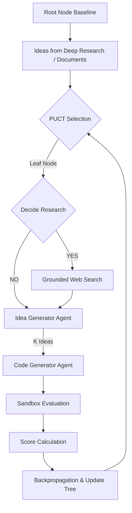

# Pathfinder: LLM-Guided Search for Automated Algorithm Discovery

Pathfinder is a research framework that uses a Monte Carlo Tree Search (MCTS) variant based on the **PUCT (Predictor Upper Confidence bound applied to Trees)** algorithm to systematically optimize and discover algorithms.

It executes code modifications inside parallel, sandboxed execution environments, evaluates performance metrics, incorporates web-search grounding to discover mathematical concepts, and guides the code evolution tree toward optimal parameters.

---

## 1. System Architecture



Pathfinder is designed to expand multiple candidate nodes concurrently. In parallel execution mode, each selected node is processed in its own isolated sandbox worker, accelerating the tree search.

---

## 2. Directory Structure

All files reside within the `pathfinder/` package directory:

*   **`config.py`**: Configuration constants, including API keys, model parameters, and search exploration constants.
*   **`client.py`**: Client wrapper for the `google-genai` SDK supporting search grounding and JSON schema output.
*   **`tree.py`**: General-purpose tree structures, PUCT/MCTS selection, backpropagation, and state serialization.
*   **`orchestrator.py`**: The generic MCTS optimization engine running the search loops.
*   **`base_sandbox.py`**: Abstract base class defining the execution and scoring interface.
*   **`base_generator.py`**: Abstract base class defining the LLM idea and code generation interface.
*   **`base_researcher.py`**: Abstract base class defining the literature search grounding interface.
*   **`visualise/`**: Contains code to visualize the generated tree in an interactive browser application.

---

## 3. Installation & Setup

Ensure the workspace virtual environment is configured and active. Install the necessary library dependencies:

```bash
# Activate your workspace venv
source venv/bin/activate

# Install requirements
pip install google-genai pydantic pyyaml
```

Set your Gemini API Key in the environment:

```bash
export GEMINI_API_KEY="your-gemini-api-key"
```

---

## 4. Customizing Pathfinder for Other Domains

Pathfinder is designed as an application-agnostic core library. To implement algorithm discovery for a custom problem domain (e.g., neural network architecture search, compiler optimizations, or heuristic algorithms), you simply inherit from the base classes and instantiate the orchestrator:

### A. Implement the Custom Sandbox
Create an evaluation class that runs the candidate code and rates it:
```python
from pathfinder.base_sandbox import BaseSandbox
from typing import Dict, Any, Tuple

class CustomSandbox(BaseSandbox):
    def evaluate(self, code: str, scenarios: Any = None) -> Tuple[bool, Dict[str, Any], str]:
        # 1. Write and execute the candidate code in your target environment
        # 2. Collect performance stats (runtime, accuracy, correctness tests)
        success = True
        metrics = {"execution_time": 0.045, "passed_tests": 10}
        error_msg = ""
        return success, metrics, error_msg

    def calculate_score(self, metrics: Dict[str, Any]) -> float:
        # Convert your raw metrics dictionary into a single float score for search selection
        return 1.0 / (1.0 + metrics.get("execution_time", 1.0))
```

### B. Implement the Custom Generator
Provide the prompting logic that decides what LLM prompts to construct when proposing and generating code changes:
```python
from pathfinder.base_generator import BaseGenerator
from typing import List, Dict, Any

class CustomGenerator(BaseGenerator):
    def generate_ideas(self, parent_metrics: Dict[str, Any], research_context: str) -> List[Dict[str, Any]]:
        # Prompt LLM to analyze metrics and propose structural modifications
        return [{"description": "Introduce caching to avoid redundant calculations", "type": "caching"}]

    def generate_code(self, idea: Dict[str, Any], parent_code: str) -> str:
        # Ask LLM to apply the proposed idea and return the raw code block
        return "def optimized_func(): ..."
```

### C. Instantiate and Run the Engine
Create a script to load your custom implementations and start the MCTS optimization loop:
```python
from pathfinder.orchestrator import MCTSEngine
from my_project.sandbox import CustomSandbox
from my_project.generator import CustomGenerator
from my_project.researcher import CustomResearcher

# 1. Initialize custom components
sandbox = CustomSandbox()
generator = CustomGenerator()
researcher = CustomResearcher()  # Inherits from BaseResearcher

# 2. Load engine and start optimization
engine = MCTSEngine(sandbox, generator, researcher, iterations=10)
engine.run(objective="Optimize sorting runtime and memory footprint", initial_code="def sort(arr): ...")
```

---

## 5. How to Use Pathfinder

### Run an Algorithm Discovery Loop
Execute a search loop of N iterations (default 10) with K children proposed per expansion step (default 3):

```bash
python main.py --iterations 5 --children 3
```

### Run Concurrently with Parallel Workers
Expand multiple nodes in the tree concurrently to speed up the search:

```bash
python main.py --iterations 5 --children 3 --workers 4
```

### Resume from a Saved Tree State
You can resume a previously interrupted search by specifying the path to the serialized `tree_state.json`:

```bash
python main.py --resume pathfinder/results/tree_state.json --iterations 5
```

### Select Search Algorithm (MCTS vs PUCT)
By default, Pathfinder uses classical PUCT. To run search using classical MCTS (UCT), pass `--mcts` or `--algorithm mcts`:

```bash
python main.py --mcts --iterations 5 --children 3
# or
python main.py --algorithm mcts --iterations 5
```

### Directed Acyclic Graph (DAG) Variant
By default, standard MCTS/PUCT generates new search nodes (child programs) by expanding a single parent node. Pathfinder also includes a **DAG variant** that enables the LLM generator to combine/merge multiple parent algorithms together:
* **DAG Iterations**: If enabled, Pathfinder runs a DAG step periodically at set intervals (e.g., every 5 iterations).
* **Multi-Parent Selection**: The engine uses a tournament selection mechanism to randomly sample a subset of nodes (e.g., 3 nodes) from the tree, identifying the highest-scoring candidate among them as the primary parent to merge with the other sampled nodes.
* **Crossover Generation**: The LLM generator is supplied with the implementation history, code, and metrics of all selected parents and generates a unified, hybridized code variant.
* **DAG Backpropagation**: The generated child node holds references to all its parent IDs (`dag_parent_ids`). Its score is backpropagated up to all parent nodes.
* **Visualization**: The interactive tree visualizer dynamically detects DAG nodes and renders cross-cutting connections between merged nodes in the tree diagram.

To run optimization with the DAG variant enabled:
```bash
python main.py \
  --iterations 15 \
  --enable-dag \
  --dag-interval 5 \
  --dag-num-parents 3
```

### Main Parameters
*   `--algorithm` / `--mode`: Selection mode: `puct` (default) or `mcts`.
*   `--mcts`: Convenient shortcut flag to run standard MCTS (UCT) search instead of PUCT.
*   `--iterations`: Number of tree selection/expansion cycles to run.
*   `--children`: Number of optimization ideas to evaluate per cycle.
*   `--prompt-file`: Path to the file containing the objective prompt (defaults to `pathfinder/prompts/example_prompt.txt`).
*   `--workers`: Number of parallel workers/nodes to expand concurrently (defaults to `1`).

---

## 6. Parallel Sandbox Execution

To prevent concurrent tree expansions from interfering with each other and corrupting the main workspace, Pathfinder uses an **isolated sandbox worker system**:

1. **Worker Selection**: In each iteration, Pathfinder selects up to `--workers` nodes using the PUCT selection criteria.
2. **Sandbox Creation**: For each worker, Pathfinder creates a dedicated directory `pathfinder/results/sandbox_worker_{worker_id}/`.
3. **Isolation & Symlinking**:
   - It symlinks general workspace files and virtual environments to the sandbox.
   - It copies the target package (excluding outputs and active code) to ensure that the python execution and relative imports resolve in isolation.
4. **Concurrent Run**: Using a `ThreadPoolExecutor`, candidates are generated and evaluated in parallel within their respective sandbox directories.
5. **Auto-Cleanup**: Once evaluation completes, the sandbox directories are automatically destroyed, and the best-performing code is merged back into the search tree.

---

## 7. View Outputs

Every run generates the following outputs under `pathfinder/results/`:
*   **`tree_state.json`**: Flat map of all nodes, visits, raw scores, and code artifacts.
*   **`report.md`**: Markdown report showing the optimization steps, performance of each node in the path, and final deployed code.
*   **`pathfinder.log`**: Standard execution logs.

### Extracting Generated Code for a Specific Node
You can extract the full Python code of any candidate node (e.g. Node 2) from `tree_state.json` using the helper script:

```bash
# Extract code for Node 2 to node_2_algorithm.py
python extract_node_code.py -n 2

# Save to a custom file name
python extract_node_code.py -n 2 -o custom_algorithm_name.py
```

### Exporting Tree Metrics to a CSV Spreadsheet
You can export all nodes and their performance metrics from `tree_state.json` to a CSV spreadsheet file (`pathfinder/results/tree_state.csv`):

```bash
python pathfinder/tree_to_spreadsheet.py
```

---

## 8. Tree Visualization

To visualize the generated search tree as a premium, interactive dark-themed dashboard:

```bash
python -m pathfinder.visualise.visualise
```

This command will:
1. Parse `tree_state.json`.
2. Generate a standalone interactive HTML dashboard at `pathfinder/results/tree_visualisation.html`.
3. Open it automatically in your web browser.

The dashboard includes two views:
*   **Tree Diagram Tab**: A graphical representation of the search path. Zoom/pan, collapse/expand nodes, and click on any node to view its detailed logs, research findings, and evaluation metrics in the sidebar.
*   **Spreadsheet Table Tab**: A premium, flat tabular view of all generated nodes and their performance metrics. It supports sorting by any metric (Score, Visits, custom metrics), text filtering/search, and cross-tab navigation.

---

## 9. LLM Model Configuration & Extension

Pathfinder supports multi-provider model routing, rate-limit fallbacks, and parameter customization out of the box.

### Configured Providers
Currently, the client wrapper (`client.py`) is configured to work with the following LLM APIs:
*   **Google Gemini** (via `google-genai` SDK or Vertex AI)
*   **OpenAI** (via Developer API key)
*   **DeepSeek** (via Developer API key)
*   **Moonshot (Kimi)** (via Developer API key)
*   **OpenRouter** (for routing to open-source models)

### How to Configure Models
You select the primary models and providers inside `pathfinder/config.py` or by setting the following environment variables:
```bash
export RESEARCH_PROVIDER="gemini"
export RESEARCH_MODEL="gemini-2.5-flash"

export GENERATOR_PROVIDER="openai"
export GENERATOR_MODEL="gpt-4o"
```

Set the corresponding API keys in your environment:
```bash
export GEMINI_API_KEY="your-gemini-key"
export OPENAI_API_KEY="your-openai-key"
export DEEPSEEK_API_KEY="your-deepseek-key"
export MOONSHOT_API_KEY="your-moonshot-key"
```

### How to Add a New Model Provider
To add a new LLM provider (e.g., Anthropic, Cohere, or a local Ollama instance):
1. **Declare the API Key / Config**: In `pathfinder/config.py`, add the new environment variable configuration:
   ```python
   ANTHROPIC_API_KEY = os.environ.get("ANTHROPIC_API_KEY", "")
   ```
2. **Initialize the SDK Client**: In `pathfinder/client.py` inside `GeminiClient.__init__`, import and initialize the SDK client wrapper for the new provider.
3. **Extend the Query Routing**: Update the `query()` method inside `pathfinder/client.py` to route queries to the new client when the specified provider is selected:
   ```python
   if provider == "anthropic":
       # Call anthropic SDK client
       # return response text
   ```
4. **Configure Fallbacks (Optional)**: Update `_select_random_fallback()` in `pathfinder/client.py` to include the new provider's models in the random fallback candidates pool in case of rate limits or API outages.

